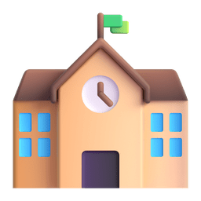

# Gatteka 

  Opa, sou Vinicius Gabriel ou como alguns me conhecem, Gatteka. Um desenvolvedor Full-Stack com foco em front-end. Ao longo de três anos pude melhorar minha capacidade e habilidade em ferramentas como Typescript, TailwindCSS, React Query e em técnicas para melhorar o SEO. Meu entusiasmo pela aprendizagem me motiva a explorar continuamente novas tecnologias, constantemente me desafiando para expandir minhas habilidades.

## Habilidades

Nos últimos anos, tenho aprendido novas tecnologias e linguagens. Esses são os que aprendi até agora.
|                        **#**                        | **Linguagem** |                       **Proficiência**                       |
| :-------------------------------------------------: | :-----------: | :----------------------------------------------------------: |
|   | `Typescript`  |  |
|       |   `NextJS`    |            |
|        |   `ReactJS`   |            |
|   | `JavaScript`  |            |
|       |   `NodeJS`    |  |
|  | `TailwindCSS` |            |

## Trabalho & Educação 

-  **Clear Cloud Software**:
  
  - ****Desenvolvedor Full-Stack****
    - Setembro, 2022– Presente
  
-  **Universidade Cruzeiro do Sul**:
  
  - **Análise e Desenvolvimento de Sistemas**
    - Fevereiro, 2023– Presente
  
  

## Github Stats 

<nobr>
</nobr>

## Discord Activity 

## Gostou do meu trabalho? 

&nbsp;[Me siga no GitHub](https://github.com/Gattekaa) 
&nbsp;[Visite meu portfólio](https://www.viniciusgabriel.tech/) 

### Obrigado por visitar!&nbsp;